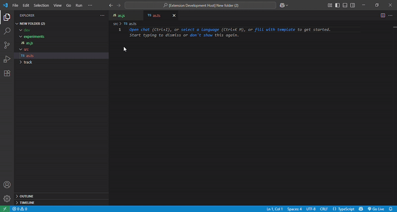

# 🎨 Color Folders - VS Code Extension

**Color Folders** is a Visual Studio Code extension that allows you to assign custom colors to folders and files in your workspace. Improve your project navigation, visually group related directories, and add flair to your coding environment.

---

## 🚀 Features

- 🌈 Assigns custom theme colors to commonly used folders like `src`, `test`, `components`, `assets`, `config`, and many more.
- 🧠 Over **80+ predefined folder color assignments** for a wide variety of project structures.
- 💡 Enhances readability and navigation in large codebases.
- 🖌️ Seamlessly works with both light and dark themes.

---

## 📦 Installation

1. Open **VS Code**
2. Go to the **Extensions** view (`Ctrl+Shift+X`)
3. Search for `Color Folders`
4. Click **Install**


---

## ⚙️ Usage

This extension automatically applies folder colors based on folder names when the editor starts.

No additional configuration is required, but you can override or customize colors via your `settings.json`:

##### Add/Change Custom Folder Colors

1.  Open Settings (JSON)

2. Edit the *colorFolders.customOverrides* setting like this: 

```json
"colorFolders.customOverrides": {
  
  "experiments": "folderColor.color62"
}
```
- Assign **color62** to **experiments** folder. You can create your own folder and assign custom colors this way. The supported color keys are folderColor.color1 to folderColor.color83

---
## Demo



---
## Built-in Folders Names

| Folder Name     | Folder Name     | Folder Name     | Folder Name     | Folder Name     | Folder Name     | Folder Name     |
|-----------------|-----------------|-----------------|-----------------|-----------------|-----------------|-----------------|
| src             | test            | public          | assets          | components      | utils           | config          |
| scripts         | build           | dist            | notebooks       | data            | models          | logs            |
| venv            | routes          | lib             | services        | middleware      | api             | .github         |
| .vscode         | .devcontainer   | chroma_db       | frontend        | design          | docs            | research        |
| styles          | themes          | source          | store           | pages           | layouts         | server          |
| env             | shared          | artifacts       | bin             | examples        | types           | migrations      |
| database        | schemas         | client          | constants       | uploads         | downloads       | static          |
| images          | icons           | media           | pipeline        | seeds           | tmp             | videos          |
| logging         | tools           | templates       | third_party     | monitoring      | analytics       | experiments     |
| jobs            | train           | tasks           | notes           | val             | diagrams        | backend         |
| environments    | dev             | prod            | staging         | feature         | ai              | ml              |
| nlp             | backup          | app             | myenv           | errors          | key             |                 |

---
## 🤝 Contribution

Feel free to open issues or pull requests on GitHub.

---
## 🧑‍💻 Author
Muneeb Ul Hassan | 
AI Developer & Open Source Contributor.
Connect with me on  [LinkedIn](https://linkedin.com/in/muneebulhassan-ml) ·  [GitHub](https://github.com/MuneebUH)
